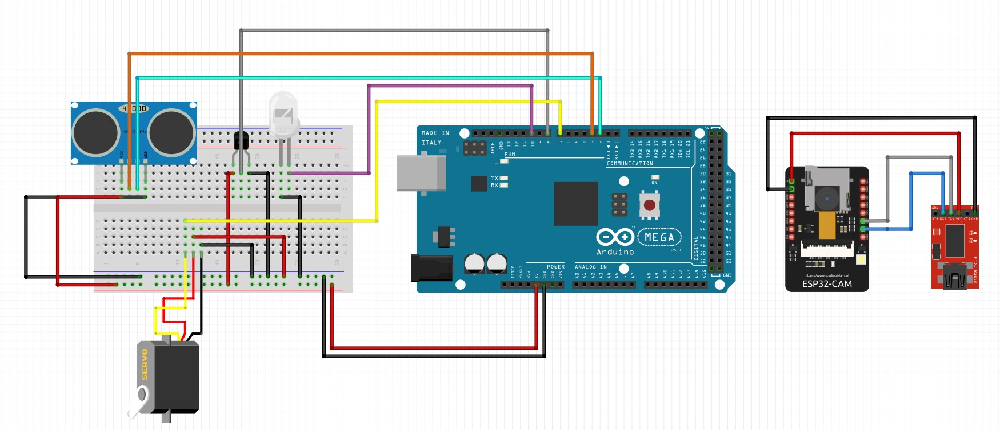
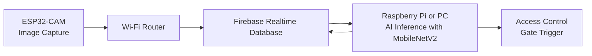

# 🛡️ M.I.D.A.S. – Mask Identification Door Access System

> **Ensure public health and safety during the COVID-19 pandemic** by automating mask detection at entry points using low-cost, accessible hardware and AI.



---

## 📌 Overview

This project leverages the **ESP32-CAM**, **Firebase Realtime Database**, and a **MobileNetV2-based Mask Detection Model** (running on a PC or Raspberry Pi) to automatically check whether people are wearing masks before entering a facility. Ideal for offices, schools, or public transport gates.

---

## 🧠 System Architecture (Mermaid Diagram)



### 🚀 Features

- 🔍 **Real-time face mask detection**  
- 📷 **ESP32-CAM-based image capture**  
- ☁️ **Firebase cloud data handling**  
- 🧠 **MobileNetV2-powered AI inference**  
- 🌐 **Web-based visualization via Flask**  
- 🔒 **Contactless access control system integration**


### 🛠️ Hardware Required

| Component              | Description                                      |
|-----------------------|--------------------------------------------------|
| **ESP32-CAM**          | Camera-enabled microcontroller                   |
| **FTDI Programmer**    | For uploading code to ESP32-CAM                  |
| **Wi-Fi Router**       | For network communication                        |
| **Raspberry Pi / PC**  | Runs the mask detection model (MobileNetV2)      |
| **Optional: Servo / Relay** | To control a gate or access mechanism       |


### 💻 Software Required

- **Arduino IDE** – To program the ESP32-CAM  
- **Python 3.x** – To run the AI model and Flask web server  
- **Firebase** – For real-time data sync between ESP32 and inference server  
- **Python Libraries**:
  ```bash
  pip install opencv-python flask tensorflow firebase-admin


### ⚙️ Setup Instructions

#### 🔌 Hardware Setup

1. Connect ESP32-CAM to FTDI programmer:
   - GND ↔ GND  
   - 5V ↔ VCC  
   - U0R ↔ TX  
   - U0T ↔ RX  
   - GPIO0 ↔ GND *(only for upload mode)*

2. Upload the code:
   - Open `application.ino` in Arduino IDE
   - Set your Wi-Fi and Firebase credentials
   - Select "AI Thinker ESP32-CAM" as board
   - Flash the code
   - Remove GPIO0 from GND and press RESET

#### 🧠 Model Setup (AI Inference on Local Device)

1. Clone this repo to your Raspberry Pi or PC  
2. Install Python dependencies:
   ```bash
   pip install opencv-python flask tensorflow firebase-admin
   ```
3. Run the Flash Server:
    ```bash
    python app.py
    ```

---

### 🧪 Model Info

This project uses a **fine-tuned MobileNetV2** model for efficient and lightweight face mask detection. It detects:

- 😷 With Mask  
- 🙅‍♂️ Without Mask

To retrain or fine-tune:
- Use `Training.py` and your custom dataset
- Validate using `Testing.py`
- View training progress in `accuracy_Graph.png`

### 📣 Contributing

Contributions are welcome! 🎉  
If you have ideas for improvements, want to report bugs, or suggest new features:

1. Fork the repository  
2. Create a new branch (`git checkout -b feature-xyz`)  
3. Commit your changes  
4. Open a pull request

Let’s make smart public health tools more accessible! 😷💡


